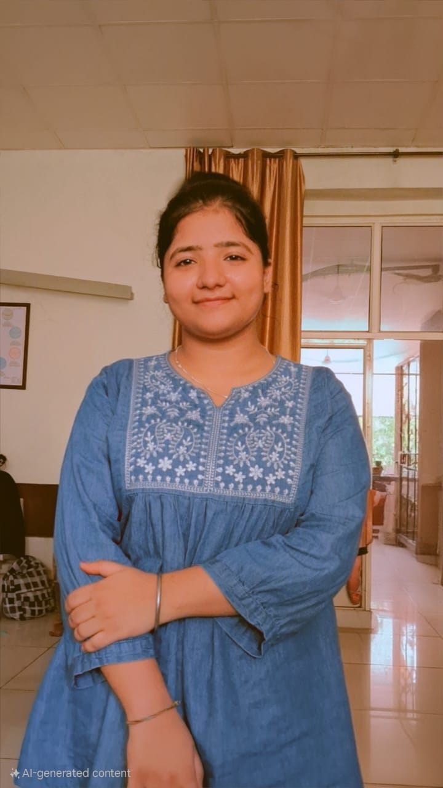

# INDUCTION-PROGRAMME2025

# Presenting Myself

**Name**: Prabhjot Kaur

**Age**:  18 years

**Branch**: Information technology

**Residence**: Ludhiana

**Class 12th details**
| Subjects         |Marks obtained|total marks|
|------------------|--------------|-----------|
|ENGLISH           |82            |100        |
|MATHS             | 61           |100        |
|PHYSICS           | 64           |100        |
|CHEMISTRY         | 86           |100        |
|PHYSICAL EDUCATION| 90           |100        |

**LINKED IN PROFILE**
[view linkedin profile](https://www.linkedin.com/in/prabhjot-kaur-971237377)

 **EMAIL**: Prb0035@gmail.com
# day1
*My first day in Gndec ludhiana was with Cse  IT  students.
Firstly we all gathered in Gurudwara and take blessings of waheguru,kirtan was recite by kirtani jatha. After that we went to hostel 2 for refreshment as per schedule prescribed by teacher then after refreshment we went to theater for **inauguration ceremony** .The ceremony was started approximately 11:15 am by reciting **Mool Mantar** 
We were introduced to the college legacy through a college orientation presentation, followed by our proud alumini- Sangam arora and Arshpreet Singh (batch 2021-25)-who were  showing how dedication and involvement beyond the classroom shaped their successful journeys.*
## insightful addresses by:-
* Dr.Sehijpal Singh (principal)
* Dr. Harpreet kaur Grewal(head of department of applied science)
* Dr. Akshay Girdhar(Dean academics)
* Dr. Parminder Singh (dean student welfare)

  
  ## Guest of Honour:
  * Er. Ravinder Garg(chief engineer,Muncipal Corporation,Ludhiana)
  * Er. Rakesh Kumar(GNDEC Alumini Batch 1991) ADC Ludhiana
    ### Who shares their inspiring journeys and encourages us to grow with values,skills,vision and many more things.

#The event was closed by the vote of thanks by dr. K.S. Maan (HOD of IT)
Thank you !!

# Day 2
*On second day, We hav our English and Maths Proficiency test based on our general knowledge

then we have break ,*

*After break , we went to auditorium directly and our induction program by reciting **Mool Mantar** 5 times.
Then our induction programme starts with welcoming speech of our seniors*
following this the induction programme was enlightened by expert talks:-

## The Experts are:
* Dr.Arvind Dhingra  (on student development via STEP and TAC)
* Dr. Arashdeep Singh (on "food:A pivotal Role in Student's overall wellness")
* Buddy 4 Study Team (to tell us about Satya scholarships)

   this is all about Day 2, THANK YOU !!

  # Day 3
  *On third day, Whole college is on holiday except **CSE and IT**. We had a productive day started with blessings of god i.e by reciting **Mool Mantar**
  This day we have experts like:*
  *Dr. Jaswinder Singh  
  (Who is renowed for jaswinS Lab on wheels, brouht Physics and Mathematics to life through fun,simplified experiments and demonstrations.)
  *Dr. Priya Darshni (who came to enlighten us with her Universal human values Lectura 1, Also enriches us with moral values which are essential to live a life full of happiness and prosperity)
  *Chief Guest : S. Gurcharan Singh Grewal ,Secratary-SGPC encouraged us with his motivating speech

  *Also,we have an interactive session with our seniors reflecting our English and Maths Profeciency test results.*
  
   *Who inspires us to work hard and live a happy life.*

  
  **At end,GitHub Introduction by seniors**
*Our day ended in the auditorium with a session led by seniors. He introduced us to GitHub, a vital tool for version control and collaboration. With his guidance, we set up our first repository, marking an important step in our journey as budding developers. This hands-on introduction was both practical and exciting, providing us with a foundational skill that will be crucial throughout our academic and professional careers.*

  ### THANK YOU!!

  # Day 4
  *On fourth day of induction, we have our classes along with induction programme.So that we can comfortably adjust ourself according to schedule .*
  *In Morning, our first Lecture is of **Professional English Communication** By **Prof. Nisha** in this lecture she helps to speak in front of all classmates without hesitation.
  Then our second Lecture is of **Chemsitry** By **Prof. Rajveer Kaur** in this lecture she helps us to recape our 11th and 12th class concepts which we are needed in fuether studies.*

#### BREAK

*After break, we have an seminar by UHV expert **Dr. Priya Darshni**i.e. is her second lecture. In this lecture she tells us unknown fact /facts neglected by us about our body and difference between our needs and oue body needs.
 then we have a 2nd seminar followed by **Causmic Club** members. In which they told us about their club ,club members,programms organised and managed by them.At the end , there were different performances such as: singing and shayri by our seniors.*

 This is all about fourth day of induction.

 THANK YOU!!

 # Day 5 
 *This is a fifth day of induction today we had classes in our classroom.
 In which our first lecture was of **Mathematics** by**Prof. Sandeep Kaur** in this lecture she helps us to recape our 11th and 12th class mathematics concepts so that it will be easy for us to persue b.tech maths.*

 *Our second lecture was of **P2P** which is lectured by our seniors in which they give brief information about **cpp** language.So that it will be easy for us to understand this language.*

 *Our third or last lecture was of **BEEE** by **prof.Sukhpal Singh** in this lecture he gives brief introduction about syllabus , marks creteria and attendence creteria of college .*

 This is all about today.**THANK YOU!!**

 # Day 6
 *This is my quite interestig day.As today we started coding peer to peer classes arranged by our seniors for helping us.

 Also this is our first lecture that is of **p2p** in this they gives us brief information about cpp language and also helps us to make code of table of 2 and 5.

 then our second lecture was of basic **electrical and electronics engineering** by **prof.Sukhpal Singh** who help us to recape ous previous 12th and 11th class concept like kirchoffs rule,ohms law,inductance,conductance,resistance. And gives brief info about nodal rule.*

## break
 
 ### In Auditorium:-

 we got an offer to meet different personalities :

 * S.Maheshinder Singh Grewal (Member of nankana trust)
   inspiires us with his words and shares his experience in gndec college.

   * S. Lakhvir singh Khanna (head of cml)
     gives brief intro about cml and nptel.Helps usto join new courses along with our degree to do minors and honors degree.

     #### This is all about today , Lets see what's happening tommorow. **THANK YOU!!**

     # Day 7

     *Today a week is completed for our induction programme.As everyday,our day started by reciting Mool Mantar 5 times .A student of CSE first year recited it.*
   Now its time for orientation programme.In auditorium,

   * Dr. Amit Kamra (Incharge DMC {digital marketing club}),which is basically based on controlling social media page of instagram,facebook,linkedin,youtube,network site.
     *Under this club students work on canva,video editing,content writting,photography,etc.
   * Dr.Parminder Singh (Dean- Student welfare)This sir tells us about all societies,clubs ,also about NCC NSS present in college  like-
          * ISTE
          * cultural committee
          * English club
          * Fmcrs
          * Digital marketing club
          * isf
          * sports
          * causmic clib
          * ecell
          * cml
          * computonics

     * Dr. Randhir Singh (Conduct of examination) This sir tells us about code of conduct of examination in college as it is antonomous college.So the college has its own code of conduct

        #### Break

       *After break, We have peer to peer  classes by our proffessors ,

       first lecture was of English by NIsha mam.

       second lecture was of Chemsitry by Rajveer mam*

# Day 8
          
#### Today was last day of induction programme . 
*On this day we have our lectures as well as our p2p interections with our professor's*

*In Morning 🌄 we had our first lecture of Mathematics in which mam gives us overview of first unit that is of differential equations*

then ##### break

*After break we have our healthy peer 2 peer interactions with prof. Jaswant Singh (he gave us information about interview placement creteria)

## That's all about our induction programme.

#### Thank you🙂🙂

